-   [Introduction](#introduction)
    -   [Data description and
        preparataion](#data-description-and-preparataion)
-   [Analytic plan](#analytic-plan)
-   [Analysis](#analysis)
    -   [Data cleaning/Descriptive
        stats](#data-cleaningdescriptive-stats)
    -   [Test hypotheses](#test-hypotheses)
    -   [Model diagnostics](#model-diagnostics)
-   [Summary/Visualization, or What's the
    Story?](#summaryvisualization-or-whats-the-story)
-   [What now?](#what-now)

Introduction
============

This is the first little project that I'm posting for this site. While
it's a good challenge and exercise to distill a project in something
that can be summarized in one post, these early examples will likely be
a bit imperfect. Also, [as I've mentioned
before](https://alexdatasci.com/about/) I'm not trying to create
generalizable research here. Since I'm using public data, it's also
possible and likely that others have done similar analyses. That's ok
with me. I'm simply trying to simulate some likely scenarios that one
might encounter out in the 'real world' and demonstrate how I might go
about tackling them.

Ok, moving on.

I decided to start with something fairly straight-forward. I'll be
analyzing data related to academic, social, and family factors of
secondary school students of two Portuguese schools. I'll start with a
simple scenario. Let's say that I'm approached by someone who has this
data, is worried about how absences are related to academic performance,
and has a sense that health and alcohol consumption might be playing a
role. They also have noticed the boys lagging behind the girls in terms
of grades. They want to quickly get a better idea of how these factors
are related, and ask me to analyze the data for them. The priority here
is to test and explore *associations*, it is not to create a model that
maximizes prediction accuracy. The end result should be a clear summary
that conveys the pertninet findings and their implications in clear,
non-technical language. You can jump ahead to that part by clicking on
'Summary/Visualization, or What’s the Story?' in the table of contents
above.

Data description and preparataion
---------------------------------

The data, spread across two csv files, represents math and Portuguese
classes and is publicly available on kaggle
[here](https://www.kaggle.com/uciml/student-alcohol-consumption#student-mat.csv).
Variable attribute information is also available
[here](https://archive.ics.uci.edu/ml/datasets/student+performance). The
official reference for the dataset is displayed below:

P. Cortez and A. Silva. Using Data Mining to Predict Secondary School
Student Performance. In A. Brito and J. Teixeira Eds., Proceedings of
5th FUture BUsiness TEChnology Conference (FUBUTEC 2008) pp. 5-12,
Porto, Portugal, April, 2008, EUROSIS, ISBN 978-9077381-39-7.

To keep this example very simple, I'll only look at the file for one
class (Portuguese).

Analytic plan
=============

Even for simple analyses, going in with a plan is important. It doesn't
have to be super complicated. Here's my basic approach for this example.

-   Data cleaning
    -   Read in the data, look for errors, recode, transform and/or
        center any variables that need it.
-   Descriptive stats
    -   Generate descriptive statistics and plots to get a feel for how
        the data looks
-   Analyses: test hypotheses
    -   Are there overall sex differences in academic performance or
        other predictors? (t-tests, boxplots for visualization)
    -   Do absences predict academic performance, controlling for health
        and sex? (multiple regression)
    -   Does alcohol intake, sex, or health predict absences? (this will
        end up being logistic regression after transforming absences to
        binary)
    -   Does alcohol consumption predict academic performance,
        controlling for absences, health, and sex? (multiple regression)
    -   Does sex moderate any of these interactions?
-   Model diagnostics (check assumptions, influential cases)
-   Summary/Visualization of results

\* For multiple and logistic regression, I'll enter the primary
variable(s) of interest first, then add covariates. Depending on
significance of coefficients, I may drop variables. For sex moderation,
I'll test interactions individually and drop any that are not
significant.

Analysis
========

A quick note on the packages I used here. For this post, I'll use the
following packages:

[dplyr](https://cran.r-project.org/web/packages/dplyr/dplyr.pdf)
[reshape2](https://cran.r-project.org/web/packages/reshape2/index.html)
[ggplot2](https://cran.r-project.org/web/packages/ggplot2/index.html)
[psych](https://cran.r-project.org/web/packages/psych/index.html)
[car](https://cran.r-project.org/web/packages/car/index.html)

I'll also occasionally use some of my own functions (denoted by \*MF)
from my personal R package that I use frequently in my workflow. That
package isn't quite ready for public consumption (a lot of it was
written when I was pretty new to R), so the documentation may be
incomplete and some of the code may be...let's call it less than
elegant. If you're still curious, you can find all of that on
[github](https://github.com/fiksdala/fiksdal/). The two convenience
functions I used in this post are
[slist](https://github.com/fiksdala/fiksdal/blob/master/R/slist.R) and
[zcent](https://github.com/fiksdala/fiksdal/blob/master/R/zcent.R).

Data cleaning/Descriptive stats
-------------------------------

First, I'll read in the data.

Now let's look at the first few observations/columns and the dataset
structure.

    head(pordf[,1:5])

    ##   school sex age address famsize
    ## 1     GP   F  18       U     GT3
    ## 2     GP   F  17       U     GT3
    ## 3     GP   F  15       U     LE3
    ## 4     GP   F  15       U     GT3
    ## 5     GP   F  16       U     GT3
    ## 6     GP   M  16       U     LE3

    str(pordf)

    ## 'data.frame':    649 obs. of  33 variables:
    ##  $ school    : Factor w/ 2 levels "GP","MS": 1 1 1 1 1 1 1 1 1 1 ...
    ##  $ sex       : Factor w/ 2 levels "F","M": 1 1 1 1 1 2 2 1 2 2 ...
    ##  $ age       : int  18 17 15 15 16 16 16 17 15 15 ...
    ##  $ address   : Factor w/ 2 levels "R","U": 2 2 2 2 2 2 2 2 2 2 ...
    ##  $ famsize   : Factor w/ 2 levels "GT3","LE3": 1 1 2 1 1 2 2 1 2 1 ...
    ##  $ Pstatus   : Factor w/ 2 levels "A","T": 1 2 2 2 2 2 2 1 1 2 ...
    ##  $ Medu      : int  4 1 1 4 3 4 2 4 3 3 ...
    ##  $ Fedu      : int  4 1 1 2 3 3 2 4 2 4 ...
    ##  $ Mjob      : Factor w/ 5 levels "at_home","health",..: 1 1 1 2 3 4 3 3 4 3 ...
    ##  $ Fjob      : Factor w/ 5 levels "at_home","health",..: 5 3 3 4 3 3 3 5 3 3 ...
    ##  $ reason    : Factor w/ 4 levels "course","home",..: 1 1 3 2 2 4 2 2 2 2 ...
    ##  $ guardian  : Factor w/ 3 levels "father","mother",..: 2 1 2 2 1 2 2 2 2 2 ...
    ##  $ traveltime: int  2 1 1 1 1 1 1 2 1 1 ...
    ##  $ studytime : int  2 2 2 3 2 2 2 2 2 2 ...
    ##  $ failures  : int  0 0 0 0 0 0 0 0 0 0 ...
    ##  $ schoolsup : Factor w/ 2 levels "no","yes": 2 1 2 1 1 1 1 2 1 1 ...
    ##  $ famsup    : Factor w/ 2 levels "no","yes": 1 2 1 2 2 2 1 2 2 2 ...
    ##  $ paid      : Factor w/ 2 levels "no","yes": 1 1 1 1 1 1 1 1 1 1 ...
    ##  $ activities: Factor w/ 2 levels "no","yes": 1 1 1 2 1 2 1 1 1 2 ...
    ##  $ nursery   : Factor w/ 2 levels "no","yes": 2 1 2 2 2 2 2 2 2 2 ...
    ##  $ higher    : Factor w/ 2 levels "no","yes": 2 2 2 2 2 2 2 2 2 2 ...
    ##  $ internet  : Factor w/ 2 levels "no","yes": 1 2 2 2 1 2 2 1 2 2 ...
    ##  $ romantic  : Factor w/ 2 levels "no","yes": 1 1 1 2 1 1 1 1 1 1 ...
    ##  $ famrel    : int  4 5 4 3 4 5 4 4 4 5 ...
    ##  $ freetime  : int  3 3 3 2 3 4 4 1 2 5 ...
    ##  $ goout     : int  4 3 2 2 2 2 4 4 2 1 ...
    ##  $ Dalc      : int  1 1 2 1 1 1 1 1 1 1 ...
    ##  $ Walc      : int  1 1 3 1 2 2 1 1 1 1 ...
    ##  $ health    : int  3 3 3 5 5 5 3 1 1 5 ...
    ##  $ absences  : int  4 2 6 0 0 6 0 2 0 0 ...
    ##  $ G1        : int  0 9 12 14 11 12 13 10 15 12 ...
    ##  $ G2        : int  11 11 13 14 13 12 12 13 16 12 ...
    ##  $ G3        : int  11 11 12 14 13 13 13 13 17 13 ...

I'll drop the variables I don't need for this quick analysis.

    df <- pordf[,slist('G3 sex health Dalc Walc absences')] #*MF for fast typing

Next, we'll look at the distributions of the final grades and absences
variables, which will be our dependent variables for the analysis.

    library(gmodels,quietly = T)
    boxplot(df$G3)

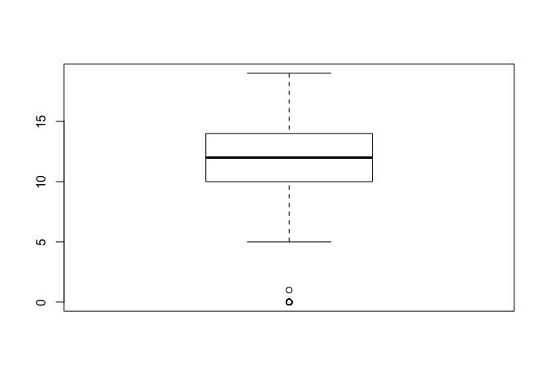

    qqnorm(df$G3)
    qqline(df$G3)

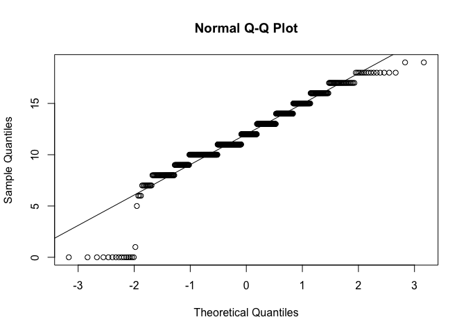

    boxplot(df$absences)

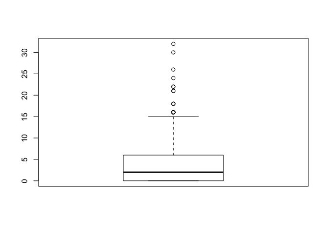

    qqnorm(df$absences)
    qqline(df$absences)

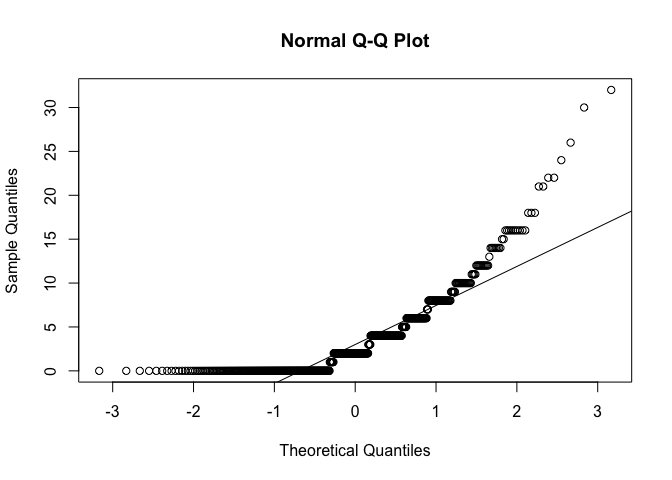

    CrossTable(df$absences>0)

    ## 
    ##  
    ##    Cell Contents
    ## |-------------------------|
    ## |                       N |
    ## |         N / Table Total |
    ## |-------------------------|
    ## 
    ##  
    ## Total Observations in Table:  649 
    ## 
    ##  
    ##           |     FALSE |      TRUE | 
    ##           |-----------|-----------|
    ##           |       244 |       405 | 
    ##           |     0.376 |     0.624 | 
    ##           |-----------|-----------|
    ## 
    ## 
    ## 
    ## 

G3 has some issues with normality, due to a bunch of observations with
values at or near zero. To make for better inferences, I'll omit values
&lt;=1. The distribution with absences is heavily skewed, with 35% of
the dataset listing 0 absences. This makes it difficult to analyze with
the normality requirements of parametric tests. Instead, I'll create a
dummy variable indicating whether a student had 0 or more than 0
absences, and then run a logistic regression model. There are other
approaches I could use instead, and I may do so in a future post. But
for now, I'll keep it simple.

    df <- df[df$G3>1,]
    df$abs_ind <- ifelse(df$absences>0,1,0)

Now let's look at some simple descriptive plots. When you have a
reasonable number of variables (or a huge display if you have slightly
more), the pairs.panels function in the psych library is pretty
convenient.

    library(psych,quietly = T)
    pairs.panels(df)

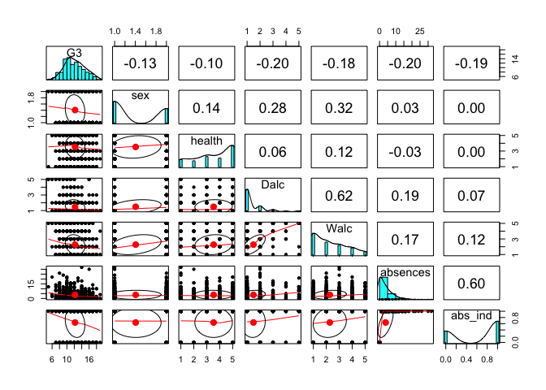

As you can see, there are some limitations there as well. When you're
dealing with integer data (particularly with smaller ranges), overlap
can make plots hard to interpret. I'll take a different approach with
ggplot to look at boxplots and scatter plots (with geom\_count to deal
with overlap) as well (note that reshaping is sometimes required for
ease of use).

    suppressMessages(library(ggplot2))
    suppressMessages(library(reshape2))
    ggdf <- melt(df,id.vars=c('sex','abs_ind'))
    # Boxplots by sex
    ggplot(ggdf,aes(sex,value)) +
      geom_boxplot() +
      facet_wrap(~variable, scales='free')

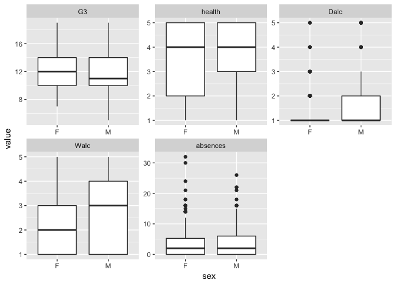

    # Boxplots by absences>0
    ggplot(ggdf[ggdf$variable!='absences',],aes(as.factor(abs_ind),value)) +
      geom_boxplot() +
      facet_wrap(~variable, scales='free',ncol=2) +
      labs(x='Absences: 1=More than 0, 0=0')

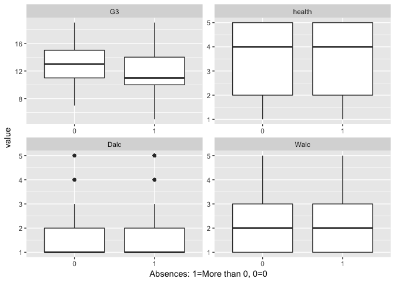

    ggdf <- melt(df,id.vars=slist('G3 sex abs_ind'))
    ggplot(ggdf, aes(value,G3,color=sex)) +
      geom_count() +
      scale_size_area() +
      geom_smooth(method='lm') +
      facet_wrap(~variable,scales='free')

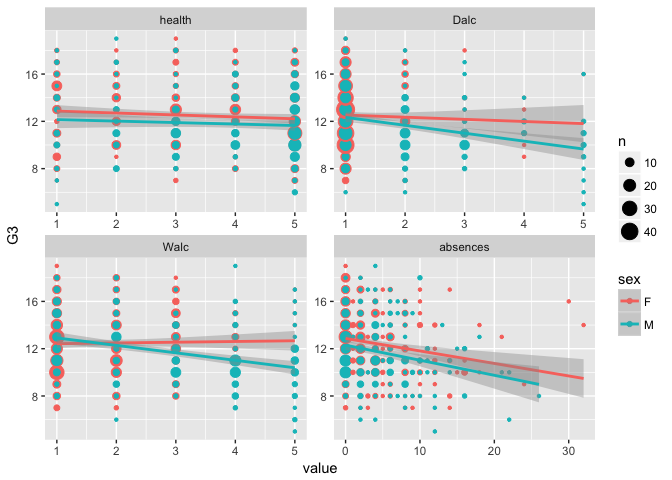

We can see from these plots that males appear to drink more alcohol than
females. We'll have to keep that in mind as we continue with the
analyses. A lot of these variables are not normally distributed (which
is not a requirement for indpendent variables). Some will require
centering to help with heteroscedasticity, interactions, and ease of
interpretation.

    df <- zcent(df,slist('health Dalc Walc absences')) #*MF

Test hypotheses
---------------

**Sex differences? Also, a quick sidenote on the utility of t-tests**

We'll look at some t-tests to see if the differences in means of
variables of interest between males and females are statistically
significantly different than 0. This particular sample has 649
observations, which depending on your point of view is either a lot or
not many. Regardless, as n increases it becomes easier to detect
statistically significant differences. This just means that your
interpretation should never stop at a p-value. Statistical tests are
only really useful in letting you know how likely it is that you drew
your sample from a population where the null hypothesis is true (in this
case, that the difference in means between males and females = 0). They
cannot tell you whether any differences are meaningful or not (that
requires interpretation). There's plenty more to say on this, but that's
for another post.

    t.test(df$G3~df$sex)

    ## 
    ##  Welch Two Sample t-test
    ## 
    ## data:  df$G3 by df$sex
    ## t = 3.198, df = 558.33, p-value = 0.001462
    ## alternative hypothesis: true difference in means is not equal to 0
    ## 95 percent confidence interval:
    ##  0.2622785 1.0973746
    ## sample estimates:
    ## mean in group F mean in group M 
    ##        12.48138        11.80156

    t.test(df$health~df$sex)

    ## 
    ##  Welch Two Sample t-test
    ## 
    ## data:  df$health by df$sex
    ## t = -3.5091, df = 575.8, p-value = 0.0004847
    ## alternative hypothesis: true difference in means is not equal to 0
    ## 95 percent confidence interval:
    ##  -0.6272768 -0.1770737
    ## sample estimates:
    ## mean in group F mean in group M 
    ##        3.364362        3.766537

    t.test(df$Dalc~df$sex)

    ## 
    ##  Welch Two Sample t-test
    ## 
    ## data:  df$Dalc by df$sex
    ## t = -6.6399, df = 371.16, p-value = 1.117e-10
    ## alternative hypothesis: true difference in means is not equal to 0
    ## 95 percent confidence interval:
    ##  -0.6719356 -0.3648845
    ## sample estimates:
    ## mean in group F mean in group M 
    ##        1.279255        1.797665

    t.test(df$Walc~df$sex)

    ## 
    ##  Welch Two Sample t-test
    ## 
    ## data:  df$Walc by df$sex
    ## t = -7.94, df = 443.74, p-value = 1.673e-14
    ## alternative hypothesis: true difference in means is not equal to 0
    ## 95 percent confidence interval:
    ##  -1.0295092 -0.6209792
    ## sample estimates:
    ## mean in group F mean in group M 
    ##        1.933511        2.758755

    t.test(df$absences~df$sex)

    ## 
    ##  Welch Two Sample t-test
    ## 
    ## data:  df$absences by df$sex
    ## t = -0.70856, df = 554.21, p-value = 0.4789
    ## alternative hypothesis: true difference in means is not equal to 0
    ## 95 percent confidence interval:
    ##  -1.0067484  0.4729708
    ## sample estimates:
    ## mean in group F mean in group M 
    ##        3.643617        3.910506

It seems that males get lower grades and drink more on average, while
females report poorer health. The difference in absences was not
statistically significant.

**Regression model**

*Do absences predict grades, controlling for health and sex?*

    m1 <- lm(G3 ~ absences_c, df)
    summary(m1)

    ## 
    ## Call:
    ## lm(formula = G3 ~ absences_c, data = df)
    ## 
    ## Residuals:
    ##     Min      1Q  Median      3Q     Max 
    ## -6.4093 -1.7109 -0.4093  1.5907  6.8497 
    ## 
    ## Coefficients:
    ##             Estimate Std. Error t value Pr(>|t|)    
    ## (Intercept) 12.20537    0.10346 117.975  < 2e-16 ***
    ## absences_c  -0.11639    0.02221  -5.241 2.18e-07 ***
    ## ---
    ## Signif. codes:  0 '***' 0.001 '**' 0.01 '*' 0.05 '.' 0.1 ' ' 1
    ## 
    ## Residual standard error: 2.603 on 631 degrees of freedom
    ## Multiple R-squared:  0.04171,    Adjusted R-squared:  0.04019 
    ## F-statistic: 27.46 on 1 and 631 DF,  p-value: 2.185e-07

    m1.cv <- lm(G3 ~ absences_c+health_c+sex, df)
    summary(m1.cv)

    ## 
    ## Call:
    ## lm(formula = G3 ~ absences_c + health_c + sex, data = df)
    ## 
    ## Residuals:
    ##     Min      1Q  Median      3Q     Max 
    ## -6.3051 -1.8024 -0.2177  1.8695  7.1014 
    ## 
    ## Coefficients:
    ##             Estimate Std. Error t value Pr(>|t|)    
    ## (Intercept) 12.44276    0.13345  93.240  < 2e-16 ***
    ## absences_c  -0.11595    0.02201  -5.268 1.89e-07 ***
    ## health_c    -0.15959    0.07148  -2.233  0.02592 *  
    ## sexM        -0.58470    0.21067  -2.775  0.00568 ** 
    ## ---
    ## Signif. codes:  0 '***' 0.001 '**' 0.01 '*' 0.05 '.' 0.1 ' ' 1
    ## 
    ## Residual standard error: 2.577 on 629 degrees of freedom
    ## Multiple R-squared:  0.06354,    Adjusted R-squared:  0.05908 
    ## F-statistic: 14.23 on 3 and 629 DF,  p-value: 5.569e-09

    anova(m1,m1.cv)

    ## Analysis of Variance Table
    ## 
    ## Model 1: G3 ~ absences_c
    ## Model 2: G3 ~ absences_c + health_c + sex
    ##   Res.Df    RSS Df Sum of Sq      F   Pr(>F)    
    ## 1    631 4275.2                                 
    ## 2    629 4177.8  2    97.412 7.3331 0.000711 ***
    ## ---
    ## Signif. codes:  0 '***' 0.001 '**' 0.01 '*' 0.05 '.' 0.1 ' ' 1

Health, absences, and sex all remain significant. The `anova` command
carries out a formal model comparison test, which indicates that the
model with covariates is the better model.

*Does alcohol consumption, sex, or health predict absences?*

    logm1 <- glm(abs_ind~Walc_c, family=binomial(link='logit'),df)
    summary(logm1)

    ## 
    ## Call:
    ## glm(formula = abs_ind ~ Walc_c, family = binomial(link = "logit"), 
    ##     data = df)
    ## 
    ## Deviance Residuals: 
    ##     Min       1Q   Median       3Q      Max  
    ## -1.6854  -1.3183   0.8124   0.9622   1.0428  
    ## 
    ## Coefficients:
    ##             Estimate Std. Error z value Pr(>|z|)    
    ## (Intercept)  0.58480    0.08370   6.987 2.81e-12 ***
    ## Walc_c       0.20463    0.06745   3.034  0.00241 ** 
    ## ---
    ## Signif. codes:  0 '***' 0.001 '**' 0.01 '*' 0.05 '.' 0.1 ' ' 1
    ## 
    ## (Dispersion parameter for binomial family taken to be 1)
    ## 
    ##     Null deviance: 827.37  on 632  degrees of freedom
    ## Residual deviance: 817.84  on 631  degrees of freedom
    ## AIC: 821.84
    ## 
    ## Number of Fisher Scoring iterations: 4

    logm1.1 <- glm(abs_ind~Dalc_c, family=binomial(link='logit'),df)
    summary(logm1.1)

    ## 
    ## Call:
    ## glm(formula = abs_ind ~ Dalc_c, family = binomial(link = "logit"), 
    ##     data = df)
    ## 
    ## Deviance Residuals: 
    ##     Min       1Q   Median       3Q      Max  
    ## -1.7033  -1.3931   0.9105   0.9760   0.9760  
    ## 
    ## Coefficients:
    ##             Estimate Std. Error z value Pr(>|z|)    
    ## (Intercept)  0.57845    0.08313   6.958 3.45e-12 ***
    ## Dalc_c       0.17234    0.09722   1.773   0.0763 .  
    ## ---
    ## Signif. codes:  0 '***' 0.001 '**' 0.01 '*' 0.05 '.' 0.1 ' ' 1
    ## 
    ## (Dispersion parameter for binomial family taken to be 1)
    ## 
    ##     Null deviance: 827.37  on 632  degrees of freedom
    ## Residual deviance: 824.05  on 631  degrees of freedom
    ## AIC: 828.05
    ## 
    ## Number of Fisher Scoring iterations: 4

    logm1.2 <- glm(abs_ind~Walc_c+Dalc_c, family=binomial(link='logit'),df)
    summary(logm1.2)

    ## 
    ## Call:
    ## glm(formula = abs_ind ~ Walc_c + Dalc_c, family = binomial(link = "logit"), 
    ##     data = df)
    ## 
    ## Deviance Residuals: 
    ##     Min       1Q   Median       3Q      Max  
    ## -1.6957  -1.3179   0.8161   0.9655   1.0653  
    ## 
    ## Coefficients:
    ##             Estimate Std. Error z value Pr(>|z|)    
    ## (Intercept)  0.58477    0.08370   6.986 2.82e-12 ***
    ## Walc_c       0.21051    0.08534   2.467   0.0136 *  
    ## Dalc_c      -0.01373    0.12174  -0.113   0.9102    
    ## ---
    ## Signif. codes:  0 '***' 0.001 '**' 0.01 '*' 0.05 '.' 0.1 ' ' 1
    ## 
    ## (Dispersion parameter for binomial family taken to be 1)
    ## 
    ##     Null deviance: 827.37  on 632  degrees of freedom
    ## Residual deviance: 817.82  on 630  degrees of freedom
    ## AIC: 823.82
    ## 
    ## Number of Fisher Scoring iterations: 4

    logm2 <- glm(abs_ind~Walc_c+sex+health_c, family=binomial(link='logit'),df)
    summary(logm2)

    ## 
    ## Call:
    ## glm(formula = abs_ind ~ Walc_c + sex + health_c, family = binomial(link = "logit"), 
    ##     data = df)
    ## 
    ## Deviance Residuals: 
    ##     Min       1Q   Median       3Q      Max  
    ## -1.7417  -1.3422   0.8431   1.0103   1.1094  
    ## 
    ## Coefficients:
    ##             Estimate Std. Error z value Pr(>|z|)    
    ## (Intercept)  0.66302    0.11232   5.903 3.57e-09 ***
    ## Walc_c       0.22921    0.07102   3.228  0.00125 ** 
    ## sexM        -0.19016    0.17976  -1.058  0.29012    
    ## health_c    -0.01366    0.05838  -0.234  0.81505    
    ## ---
    ## Signif. codes:  0 '***' 0.001 '**' 0.01 '*' 0.05 '.' 0.1 ' ' 1
    ## 
    ## (Dispersion parameter for binomial family taken to be 1)
    ## 
    ##     Null deviance: 827.37  on 632  degrees of freedom
    ## Residual deviance: 816.60  on 629  degrees of freedom
    ## AIC: 824.6
    ## 
    ## Number of Fisher Scoring iterations: 4

    exp(logm2$coefficients[2]) # Odds Ratio

    ##   Walc_c 
    ## 1.257609

Weekend alcohol consumption, but not daily alcohol consumption,
positively predicts whether a student will have more than one absence.
Specifically, per one unit increase in Walc, the log odds of missing any
classes will increase .23. This means for that one unit increase, the
the odds of a student missing any class will go up by about 25.8%.

*Does alcohol consumption predict academic performance, controlling for
absences, health, and sex?*

First, let's take a look at the two measures of alcohol.

    alc1 <- lm(G3~Dalc_c,df)
    alc2 <- lm(G3~Walc_c,df)
    summary(alc1)

    ## 
    ## Call:
    ## lm(formula = G3 ~ Dalc_c, data = df)
    ## 
    ## Residuals:
    ##     Min      1Q  Median      3Q     Max 
    ## -6.4861 -1.9128 -0.3395  1.5139  6.6605 
    ## 
    ## Coefficients:
    ##             Estimate Std. Error t value Pr(>|t|)    
    ## (Intercept)  12.2054     0.1036 117.794  < 2e-16 ***
    ## Dalc_c       -0.5733     0.1136  -5.045 5.95e-07 ***
    ## ---
    ## Signif. codes:  0 '***' 0.001 '**' 0.01 '*' 0.05 '.' 0.1 ' ' 1
    ## 
    ## Residual standard error: 2.607 on 631 degrees of freedom
    ## Multiple R-squared:  0.03877,    Adjusted R-squared:  0.03724 
    ## F-statistic: 25.45 on 1 and 631 DF,  p-value: 5.95e-07

    summary(alc2)

    ## 
    ## Call:
    ## lm(formula = G3 ~ Walc_c, data = df)
    ## 
    ## Residuals:
    ##     Min      1Q  Median      3Q     Max 
    ## -6.3049 -1.6756 -0.1928  1.6951  7.4365 
    ## 
    ## Coefficients:
    ##             Estimate Std. Error t value Pr(>|t|)    
    ## (Intercept) 12.20537    0.10398 117.380  < 2e-16 ***
    ## Walc_c      -0.37070    0.08119  -4.566 5.98e-06 ***
    ## ---
    ## Signif. codes:  0 '***' 0.001 '**' 0.01 '*' 0.05 '.' 0.1 ' ' 1
    ## 
    ## Residual standard error: 2.616 on 631 degrees of freedom
    ## Multiple R-squared:  0.03198,    Adjusted R-squared:  0.03045 
    ## F-statistic: 20.85 on 1 and 631 DF,  p-value: 5.979e-06

    alc3 <- lm(G3~Dalc_c+Walc_c,df)
    summary(alc3)

    ## 
    ## Call:
    ## lm(formula = G3 ~ Dalc_c + Walc_c, data = df)
    ## 
    ## Residuals:
    ##    Min     1Q Median     3Q    Max 
    ## -6.456 -1.668 -0.261  1.544  6.925 
    ## 
    ## Coefficients:
    ##             Estimate Std. Error t value Pr(>|t|)    
    ## (Intercept)  12.2054     0.1034 118.019  < 2e-16 ***
    ## Dalc_c       -0.4068     0.1449  -2.808  0.00514 ** 
    ## Walc_c       -0.1906     0.1031  -1.848  0.06505 .  
    ## ---
    ## Signif. codes:  0 '***' 0.001 '**' 0.01 '*' 0.05 '.' 0.1 ' ' 1
    ## 
    ## Residual standard error: 2.602 on 630 degrees of freedom
    ## Multiple R-squared:  0.04395,    Adjusted R-squared:  0.04091 
    ## F-statistic: 14.48 on 2 and 630 DF,  p-value: 7.103e-07

    pwcorr(df,slist('Dalc Walc'))

    ## 
    ## |-Cell Contents-|
    ## |       r       |
    ## |       p       |
    ## |       n       |
    ## |---------------|
    ## 
    ##      Dalc     Walc  
    ## Dalc 1.0000         
    ##                     
    ##                     
    ## Walc 0.6220   1.0000
    ##      0.0000         
    ##      633.0000

Controlling for daily drinking, weekend drinking is no longer a
significant predictor. They are correlated, but not *extremely* highly
(r=.62), so I'll keep both in the model. Let's add the other variables.

    m2 <- lm(G3 ~ sex+absences_c+health_c+Dalc_c+Walc_c, df)
    summary(m2)

    ## 
    ## Call:
    ## lm(formula = G3 ~ sex + absences_c + health_c + Dalc_c + Walc_c, 
    ##     data = df)
    ## 
    ## Residuals:
    ##     Min      1Q  Median      3Q     Max 
    ## -5.7942 -1.7804 -0.0885  1.8044  6.8289 
    ## 
    ## Coefficients:
    ##             Estimate Std. Error t value Pr(>|t|)    
    ## (Intercept) 12.34335    0.13548  91.110  < 2e-16 ***
    ## sexM        -0.33985    0.22082  -1.539   0.1243    
    ## absences_c  -0.09977    0.02229  -4.476 9.03e-06 ***
    ## health_c    -0.14713    0.07117  -2.067   0.0391 *  
    ## Dalc_c      -0.31750    0.14418  -2.202   0.0280 *  
    ## Walc_c      -0.10855    0.10381  -1.046   0.2961    
    ## ---
    ## Signif. codes:  0 '***' 0.001 '**' 0.01 '*' 0.05 '.' 0.1 ' ' 1
    ## 
    ## Residual standard error: 2.555 on 627 degrees of freedom
    ## Multiple R-squared:  0.08223,    Adjusted R-squared:  0.07491 
    ## F-statistic: 11.24 on 5 and 627 DF,  p-value: 2.167e-10

    anova(m1.cv,m2)

    ## Analysis of Variance Table
    ## 
    ## Model 1: G3 ~ absences_c + health_c + sex
    ## Model 2: G3 ~ sex + absences_c + health_c + Dalc_c + Walc_c
    ##   Res.Df    RSS Df Sum of Sq      F   Pr(>F)   
    ## 1    629 4177.8                                
    ## 2    627 4094.4  2     83.36 6.3827 0.001803 **
    ## ---
    ## Signif. codes:  0 '***' 0.001 '**' 0.01 '*' 0.05 '.' 0.1 ' ' 1

Some interesting things are revealed here. Controlling for everything
else, sexis no longer statistically significant and the significance
level of weekend alcohol has gone up as well. All else being equal,
health, absences, and daily alcohol seem to be the strongest predictors
of academic performance. Given that we know there are other sex
differences though, let's take a look at the interactions with sex and
conditional effects.

*Sex as a moderator*

    logm2.1 <- glm(abs_ind~Walc_c*sex+health_c, family=binomial(link='logit'),df)
    summary(logm2.1)

    ## 
    ## Call:
    ## glm(formula = abs_ind ~ Walc_c * sex + health_c, family = binomial(link = "logit"), 
    ##     data = df)
    ## 
    ## Deviance Residuals: 
    ##     Min       1Q   Median       3Q      Max  
    ## -1.7281  -1.3553   0.8288   0.9857   1.1473  
    ## 
    ## Coefficients:
    ##             Estimate Std. Error z value Pr(>|z|)    
    ## (Intercept)  0.63534    0.11561   5.495  3.9e-08 ***
    ## Walc_c       0.16101    0.10505   1.533    0.125    
    ## sexM        -0.18118    0.17919  -1.011    0.312    
    ## health_c    -0.01507    0.05840  -0.258    0.796    
    ## Walc_c:sexM  0.12334    0.14212   0.868    0.385    
    ## ---
    ## Signif. codes:  0 '***' 0.001 '**' 0.01 '*' 0.05 '.' 0.1 ' ' 1
    ## 
    ## (Dispersion parameter for binomial family taken to be 1)
    ## 
    ##     Null deviance: 827.37  on 632  degrees of freedom
    ## Residual deviance: 815.85  on 628  degrees of freedom
    ## AIC: 825.85
    ## 
    ## Number of Fisher Scoring iterations: 4

    m3.1 <- lm(G3 ~ sex*absences_c+health_c+Dalc_c+Walc_c, df)
    summary(m3.1)

    ## 
    ## Call:
    ## lm(formula = G3 ~ sex * absences_c + health_c + Dalc_c + Walc_c, 
    ##     data = df)
    ## 
    ## Residuals:
    ##     Min      1Q  Median      3Q     Max 
    ## -5.7935 -1.7801 -0.0878  1.8040  6.8290 
    ## 
    ## Coefficients:
    ##                  Estimate Std. Error t value Pr(>|t|)    
    ## (Intercept)     12.343413   0.135701  90.960  < 2e-16 ***
    ## sexM            -0.339924   0.221097  -1.537 0.124691    
    ## absences_c      -0.099581   0.028302  -3.519 0.000465 ***
    ## health_c        -0.147127   0.071232  -2.065 0.039292 *  
    ## Dalc_c          -0.317376   0.144734  -2.193 0.028688 *  
    ## Walc_c          -0.108509   0.103954  -1.044 0.296972    
    ## sexM:absences_c -0.000485   0.044909  -0.011 0.991386    
    ## ---
    ## Signif. codes:  0 '***' 0.001 '**' 0.01 '*' 0.05 '.' 0.1 ' ' 1
    ## 
    ## Residual standard error: 2.557 on 626 degrees of freedom
    ## Multiple R-squared:  0.08223,    Adjusted R-squared:  0.07343 
    ## F-statistic: 9.348 on 6 and 626 DF,  p-value: 7.776e-10

    m3.2 <- lm(G3 ~ absences_c+sex*health_c+Dalc_c+Walc_c, df)
    summary(m3.2)

    ## 
    ## Call:
    ## lm(formula = G3 ~ absences_c + sex * health_c + Dalc_c + Walc_c, 
    ##     data = df)
    ## 
    ## Residuals:
    ##    Min     1Q Median     3Q    Max 
    ## -5.767 -1.767 -0.097  1.796  6.889 
    ## 
    ## Coefficients:
    ##               Estimate Std. Error t value Pr(>|t|)    
    ## (Intercept)   12.34019    0.13591  90.795  < 2e-16 ***
    ## absences_c    -0.09987    0.02231  -4.477 9.01e-06 ***
    ## sexM          -0.34366    0.22128  -1.553   0.1209    
    ## health_c      -0.16500    0.08948  -1.844   0.0656 .  
    ## Dalc_c        -0.31437    0.14459  -2.174   0.0301 *  
    ## Walc_c        -0.11123    0.10420  -1.067   0.2862    
    ## sexM:health_c  0.04859    0.14732   0.330   0.7416    
    ## ---
    ## Signif. codes:  0 '***' 0.001 '**' 0.01 '*' 0.05 '.' 0.1 ' ' 1
    ## 
    ## Residual standard error: 2.557 on 626 degrees of freedom
    ## Multiple R-squared:  0.08239,    Adjusted R-squared:  0.07359 
    ## F-statistic: 9.368 on 6 and 626 DF,  p-value: 7.392e-10

    m3.3 <- lm(G3 ~ absences_c+health_c+sex*(Dalc_c+Walc_c), df)
    summary(m3.3)

    ## 
    ## Call:
    ## lm(formula = G3 ~ absences_c + health_c + sex * (Dalc_c + Walc_c), 
    ##     data = df)
    ## 
    ## Residuals:
    ##     Min      1Q  Median      3Q     Max 
    ## -6.1093 -1.7813 -0.0676  1.7091  7.3223 
    ## 
    ## Coefficients:
    ##              Estimate Std. Error t value Pr(>|t|)    
    ## (Intercept) 12.462980   0.139982  89.033  < 2e-16 ***
    ## absences_c  -0.098099   0.022113  -4.436 1.08e-05 ***
    ## health_c    -0.139829   0.070776  -1.976  0.04863 *  
    ## sexM        -0.339573   0.219426  -1.548  0.12224    
    ## Dalc_c      -0.204653   0.227841  -0.898  0.36941    
    ## Walc_c       0.173507   0.139448   1.244  0.21388    
    ## sexM:Dalc_c -0.003862   0.296409  -0.013  0.98961    
    ## sexM:Walc_c -0.599231   0.205879  -2.911  0.00374 ** 
    ## ---
    ## Signif. codes:  0 '***' 0.001 '**' 0.01 '*' 0.05 '.' 0.1 ' ' 1
    ## 
    ## Residual standard error: 2.535 on 625 degrees of freedom
    ## Multiple R-squared:    0.1,  Adjusted R-squared:  0.08994 
    ## F-statistic: 9.923 on 7 and 625 DF,  p-value: 8.933e-12

    m3.4 <- lm(G3 ~ absences_c+health_c+Dalc_c+sex*Walc_c, df)
    summary(m3.4) # Female conditional

    ## 
    ## Call:
    ## lm(formula = G3 ~ absences_c + health_c + Dalc_c + sex * Walc_c, 
    ##     data = df)
    ## 
    ## Residuals:
    ##     Min      1Q  Median      3Q     Max 
    ## -6.1112 -1.7810 -0.0679  1.7090  7.3248 
    ## 
    ## Coefficients:
    ##             Estimate Std. Error t value Pr(>|t|)    
    ## (Intercept) 12.46272    0.13849  89.992  < 2e-16 ***
    ## absences_c  -0.09810    0.02210  -4.440 1.06e-05 ***
    ## health_c    -0.13977    0.07057  -1.981 0.048066 *  
    ## Dalc_c      -0.20693    0.14630  -1.414 0.157746    
    ## sexM        -0.33940    0.21884  -1.551 0.121439    
    ## Walc_c       0.17414    0.13055   1.334 0.182707    
    ## sexM:Walc_c -0.60073    0.17078  -3.518 0.000467 ***
    ## ---
    ## Signif. codes:  0 '***' 0.001 '**' 0.01 '*' 0.05 '.' 0.1 ' ' 1
    ## 
    ## Residual standard error: 2.533 on 626 degrees of freedom
    ## Multiple R-squared:    0.1,  Adjusted R-squared:  0.09139 
    ## F-statistic:  11.6 on 6 and 626 DF,  p-value: 2.479e-12

    df$female <- ifelse(df$sex=='F',1,0) # Create female dummy code
    m3.4m <- lm(G3 ~ absences_c+health_c+Dalc_c+female*Walc_c, df)
    summary(m3.4m) # Male conditional

    ## 
    ## Call:
    ## lm(formula = G3 ~ absences_c + health_c + Dalc_c + female * Walc_c, 
    ##     data = df)
    ## 
    ## Residuals:
    ##     Min      1Q  Median      3Q     Max 
    ## -6.1112 -1.7810 -0.0679  1.7090  7.3248 
    ## 
    ## Coefficients:
    ##               Estimate Std. Error t value Pr(>|t|)    
    ## (Intercept)   12.12333    0.16790  72.205  < 2e-16 ***
    ## absences_c    -0.09810    0.02210  -4.440 1.06e-05 ***
    ## health_c      -0.13977    0.07057  -1.981 0.048066 *  
    ## Dalc_c        -0.20693    0.14630  -1.414 0.157746    
    ## female         0.33940    0.21884   1.551 0.121439    
    ## Walc_c        -0.42658    0.13696  -3.115 0.001926 ** 
    ## female:Walc_c  0.60073    0.17078   3.518 0.000467 ***
    ## ---
    ## Signif. codes:  0 '***' 0.001 '**' 0.01 '*' 0.05 '.' 0.1 ' ' 1
    ## 
    ## Residual standard error: 2.533 on 626 degrees of freedom
    ## Multiple R-squared:    0.1,  Adjusted R-squared:  0.09139 
    ## F-statistic:  11.6 on 6 and 626 DF,  p-value: 2.479e-12

Here we can see that there's a significant interaction with weekend
alcohol consumption and sex predicting grades. The conditional effect of
weekend alcohol consumption among females continues to be
non-significant. However, among males, this is not the case. Their
coefficient estimate is ~ .6 less than the female estimate of .17
(non-significant), meaning that for every one unit increase in weekend
drinking, final grades for males go down .42 on average (this
coefficient is significant for males).

Incorporating this interaction also makes the effect of daily alcohol
consumption non-significant.

Model diagnostics
-----------------

Before we accept this as our final grades model and create some helpful
visualizations for our summary, let's run some model diagnostics to make
sure we don't have problems with assumptions or outliers. There's a nice
variety of diagnostics in the `car` package.

    suppressMessages(library(car))
    plot(m3.4$resid) # Normal distribution of residuals?

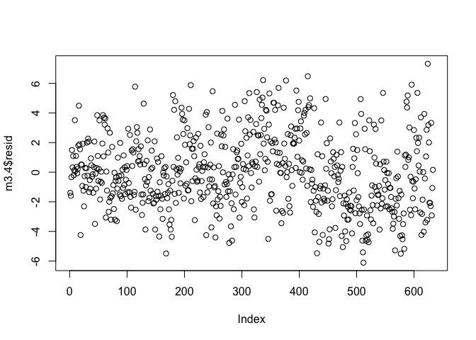

    qqPlot(m3.4) # Normal distribution of residuals?

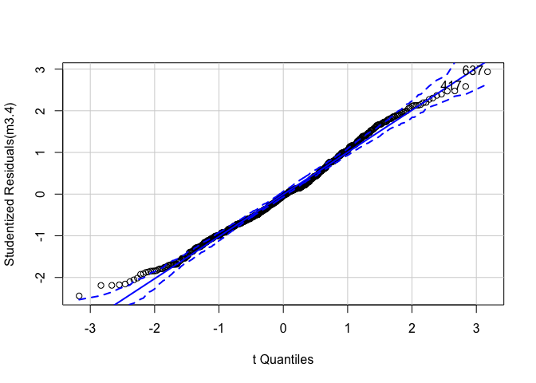

    ## 417 637 
    ## 415 624

    plot(m3.4,which=4) # Cook's d for high influence

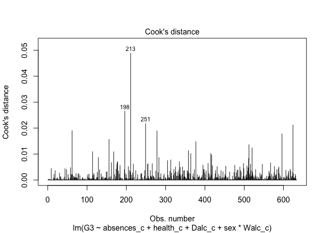

    vif(m3.4) # Multicolinearity

    ## absences_c   health_c     Dalc_c        sex     Walc_c sex:Walc_c 
    ##   1.045548   1.029299   1.755982   1.139902   2.759002   2.508729

    df$cooks <- cooks.distance(m3.4) # Add cook's d values

The residuals look fairly normally distributed, and vifs look good as
well. There is one case that has a cook's distance noticeably higher
than the rest of the sample, so just to be sure let's re-run the model
omitting that observation.

    m3.4_diagnostics <- lm(G3 ~ absences_c+health_c+Dalc_c+sex*Walc_c, 
                           df[df$cooks<.04,])
    summary(m3.4_diagnostics) # Female conditional

    ## 
    ## Call:
    ## lm(formula = G3 ~ absences_c + health_c + Dalc_c + sex * Walc_c, 
    ##     data = df[df$cooks < 0.04, ])
    ## 
    ## Residuals:
    ##     Min      1Q  Median      3Q     Max 
    ## -6.0900 -1.7456 -0.0895  1.6729  7.3245 
    ## 
    ## Coefficients:
    ##             Estimate Std. Error t value Pr(>|t|)    
    ## (Intercept) 12.44215    0.13823  90.010  < 2e-16 ***
    ## absences_c  -0.11013    0.02258  -4.878 1.36e-06 ***
    ## health_c    -0.13459    0.07033  -1.914 0.056135 .  
    ## Dalc_c      -0.20652    0.14575  -1.417 0.156993    
    ## sexM        -0.32256    0.21813  -1.479 0.139715    
    ## Walc_c       0.16330    0.13013   1.255 0.210007    
    ## sexM:Walc_c -0.58115    0.17033  -3.412 0.000687 ***
    ## ---
    ## Signif. codes:  0 '***' 0.001 '**' 0.01 '*' 0.05 '.' 0.1 ' ' 1
    ## 
    ## Residual standard error: 2.523 on 625 degrees of freedom
    ## Multiple R-squared:  0.1053, Adjusted R-squared:  0.09674 
    ## F-statistic: 12.26 on 6 and 625 DF,  p-value: 4.526e-13

    length(df$cooks[df$cooks>.05])

    ## [1] 0

This results in a small change to the health coefficient (making its p
value just slightly greater than the usual .05 cutoff); however, the
overall interpretation wont change much, so I'll stick with the first
model. To get a sense of variation and uncertainty of estimates, let's
also take a quick look at the 95% CIs.

    confint(m3.4)

    ##                   2.5 %       97.5 %
    ## (Intercept) 12.19076895 12.734680281
    ## absences_c  -0.14148723 -0.054707235
    ## health_c    -0.27834348 -0.001192718
    ## Dalc_c      -0.49423109  0.080375050
    ## sexM        -0.76915651  0.090359402
    ## Walc_c      -0.08222021  0.430504224
    ## sexM:Walc_c -0.93608936 -0.265364441

The CI for health gets very close to zero on the lower bound. That,
combined with the limited range of values (1 to 5, means that we can be
confident that the mean difference between 'very healthy' and 'very
unhealthy' in the population is no greater than 1.1133739 and may be as
little as 0.0047709.

I'll also create some visualizations that'll come in handy when
summarizing results:

    # First get predictions
    ## Walc predictions
    wvs <- unique(df$Walc_c)[order(unique(df$Walc_c))]
    drink_predict <- data.frame(absences_c=0,
                                        health_c=0,
                                        Dalc_c=0,
                                        sex=slist('M M M M M F F F F F'),
                                        Walc_c=c(wvs,wvs))
    drink_predict <- cbind(drink_predict,predict(m3.4,
                             drink_predict,
                             interval = 'confidence'))
    colnames(drink_predict)[6:8] <- slist('final_grade lwr upr')
    drink_predict$Weekend_Alcohol <- c(1,2,3,4,5)

    ## Health predictions
    hvs <- unique(df$health_c)[order(unique(df$health_c))]
    health_predict <- data.frame(absences_c=0,
                                        health_c=hvs,
                                        Dalc_c=0,
                                        sex='F',
                                        Walc_c=0)
    health_predict <- cbind(health_predict,predict(m3.4,
                             health_predict,
                             interval = 'confidence'))
    colnames(health_predict)[6:8] <- slist('final_grade lwr upr')
    health_predict$Health <- c(1,2,3,4,5)

    ## Absence predictions
    absence_pred <- data.frame(absences_c=df$absences_c,
                                        health_c=0,
                                        Dalc_c=0,
                                        sex='F',
                                        Walc_c=0)
    absence_pred <- cbind(absence_pred,predict(m3.4,
                             absence_pred,
                             interval = 'confidence'))
    colnames(absence_pred)[6:8] <- slist('final_grade lwr upr')
    absence_pred$Absences <- df$absences

    # Logistic predictions
    logpred <- data.frame(Walc_c=wvs,
                          sex='M',
                          health_c=0,
                          Walc=c(1:5))
    logpred$probability <- predict(logm2,logpred,type='response')

    # Then make graphs
    alc_graph <- ggplot(drink_predict,aes(Weekend_Alcohol,final_grade,linetype=sex)) +
      geom_count(data=df,aes(Walc,G3,color=sex)) +
      geom_line() +
      geom_ribbon(aes(ymin=lwr,ymax=upr),alpha=.2) +
      theme_bw()+
      labs(y='Final Grade',x='Weekend Alcohol Consumption (1=Very Low, 5=Very High)') +
      ggtitle('Final Grades by Weekend Alcohol Consumption and Sex')

    health_graph <- ggplot(health_predict,aes(Health,final_grade)) +
      geom_count(data=df,aes(health,G3)) +
      geom_line() +
      geom_ribbon(aes(ymin=lwr,ymax=upr),alpha=.2) +
      theme_bw() +
      labs(y='Final Grade') +
      ggtitle('Final Grades by Health (1=Very Bad, 5=Very Good)')

    abs_graph <- ggplot(absence_pred, aes(Absences,final_grade)) +
      geom_count(data=df,aes(absences,G3)) +
      geom_line() +
      geom_ribbon(aes(ymin=lwr,ymax=upr),alpha=.2) +
      theme_bw() +
      labs(y='Final Grade') +
      ggtitle('Final Grades by Absences')

    log_graph <- ggplot(logpred, aes(Walc,probability)) +
      geom_line() +
      labs(x='Weekend Alcohol Comsumption (1=Very Low, 5=Very High)',
           y='Probability') +
      ggtitle('Probability of Missing Any Classes by Alcohol Consumption') +
      theme_bw()

Summary/Visualization, or What's the Story?
===========================================

Ideally, I like to finish projects with a summary that is succinct and
[tells a story](https://alexdatasci.com/my-approach-to-data-analysis/).
It should have a short introduction, a brief explanation of variables
and methods and a conclusion that sums up results and implications.
Language should be non-technical whenever possible, while also clearly
conveying important concepts like uncertainty and other limitations.
Finally, proper visualizations should be used to sum up results
(fewer=better).

**Introduction**

A variety of factors influence academic performance. While most teachers
can annectdotally describe why some students perform better than others,
it can also be useful to use statistical techniques to tease apart what
predicts performance under which circumstances while taking into account
other factors. Here, I've analyzed how sex, health, and alcohol
consumption are associated with school attendance and academic
performance.

**Methods**

I looked at student performance of two Portuguese schools in one subject
(Portuguese). I used multiple regression to predict final grades using
the following variables:

-   Sex (male or female)
-   Dalc - (workday alcohol consumption, from 1 - very low to 5 - very
    high)
-   Walc - (weekend alcohol consumption, from 1 - very low to 5 - very
    high)
-   health - (current health status, from 1 - very bad to 5 - very good)
-   absences - (number of school absences)

In addition to their individual contributions, I looked at whether they
predicted grades differently for males than females.

**Conclusions**

*Absences*

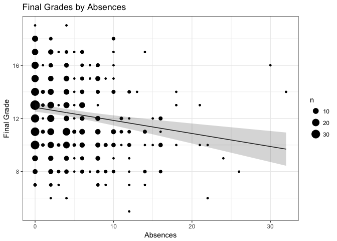

Absences negatively predict final grades, regardless of sex, health, or
drinking behavior. There's a lot of variation overall, but on average
students with 15 absences will acheive a grade about 1.5 points lower
than students with no absences.

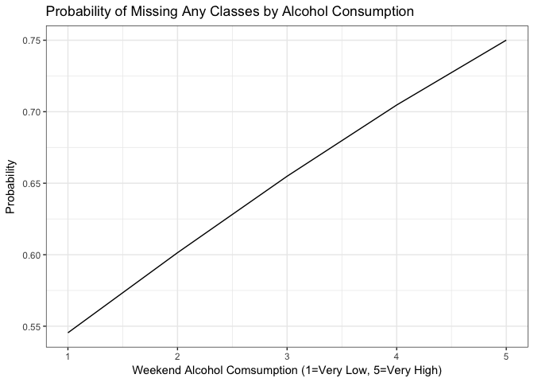

Increased weekend alcohol consumption does predict absences, controlling
for sex and health. A student who drinks very little on the weekends
will have a 50% chance of missing any classes on average. Conversely, a
student who drinks very heavily on the weekend will have a 75% chance of
missing any classes. Sex and health did not predict the school absences.

*Health*

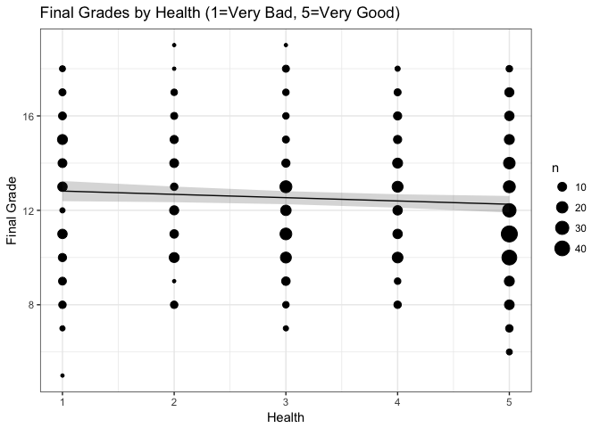

Better health technically predicts lower grades; however, the difference
between very healthy and very unhealthy students is less than 1 point
and, taking into account the confidence interval, may be as small as
4/1000 of a point. This is a situation where 'significant' likely
doesn't mean 'meaningful'.

*Sex and Alcohol Consumption*

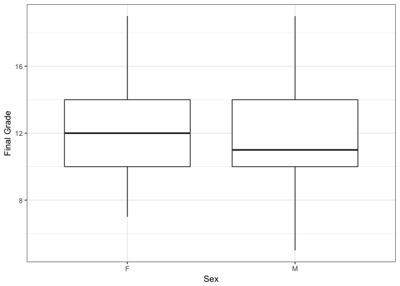

At first glance, it appears males perform slightly more poorly than
females. However, when alcohol (which males consume in greater
quantities and frequencies) is taken into account, the difference
between males and females isn't significant.

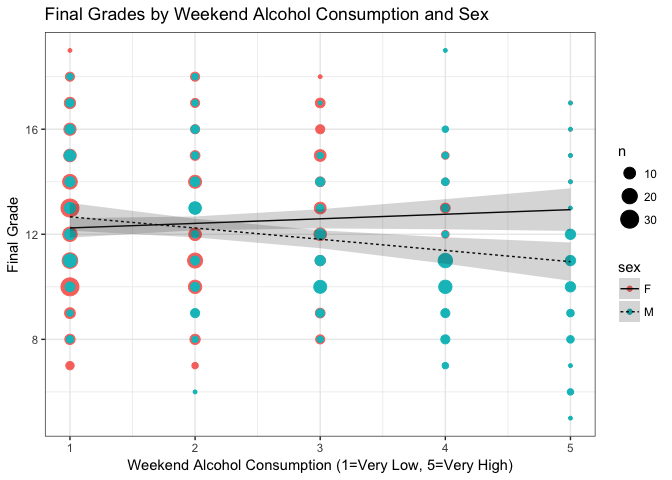

Among males, more weekend alcohol consumption predicts lower grades.
Heavy weekend drinkers will have a final grade 1.7 points lower on
average than those who drink very little. Among females, weekend alcohol
consumption is not predictive of final grades.

**What does this all mean?**

There is a lot of variation overall in grades, and the role of the
variables summarized here only explains a small portion of it (about 9%
based on our regression model). The finding that better health is
associated with slightly lower grades was unexpected, but should also be
interpreted with a grain of salt. Between the very small magnitude and
amount of uncertainty assocaited with the estimate, any differences in
grades based on health alone are probably not very meaningful.

On the other hand, absences do clearly predict grades, as does weekend
alcohol consumption (for males only). Those who drink on the weekend are
also more likely to miss any school. Taken together, although the
effects may be modest and probably only make a difference of a couple
points on average, school absences and weekend drinking are attractive
targets for interventions to improve academic performance, particularly
for young men.

What now?
=========

This first post was a way for me to get a feel for how I want to present
projects on the site. I'll tackle more complex datasets, problems, and
tools as I continue to post. I also home to continue to improve the
quality of posts as I get more used to this format, develop ideas for
projects, and my work becomes more streamlined. Still, this should give
you an idea of my general approach to soloving problems with data
analysis, and what you can expect from the site.

I'm not going to deal with comments on this site, but if you have
questions or would like to get in touch, feel free to email me at
<alex@alexdatasci.com>.
