Academic Prediction
================
Alexander Fiksdal

-   [Introduction](#introduction)
    -   [What is elastic net regression and why use it?](#what-is-elastic-net-regression-and-why-use-it)
    -   [What is k-fold repeated cross validation and why use it?](#what-is-k-fold-repeated-cross-validation-and-why-use-it)
-   [Analytic Plan](#analytic-plan)
-   [Analysis](#analysis)
    -   [Data prep](#data-prep)
    -   [Train models](#train-models)
-   [Summary/Interpretation](#summaryinterpretation)

Introduction
============

&ast;I've recently noticed that github doesn't correctly render LaTeX equations as they are written in .Rmd files. There also does not appear to be a solution. If I find a solution in the future, I'll make adjustments, but for now, there's nothing to be done. Sorry for the inconvenience.

My [last post](https://alexdatasci.com/academic-performance-first-post/) focused on using regression analyses to gain insights into academic performance. That emphasis on associations is familiar territory for those of us with academic backgrounds. In industry, sometimes these sort of insights are exactly what's needed. Other times, individual associations are less important than the overall predictive value of a model. For this post, I'll pretend I'm in a scenario where that's the case. Someone comes to me with the same type of data as last time that includes student-level information on various school, social, and family-related factors and wants to predict how well a student will perform academically based on those variables. Instead of the 'Portuguese' dataset that had ~650 observations, I'll be analyzing the 'Math' dataset, which has only 395. Given the 32 possible predictor variables, what's the best approach to creating a model that is as accurate as possible? I'll explore both unregularized and [regularized](https://en.wikipedia.org/wiki/Regularization_(mathematics)) linear regression to address that question. I'll also use this scenario to highlight a few things I also discussed in [my approach to data analysis](https://alexdatasci.com/my-approach-to-data-analysis/): the importance of parsimony, garbage in garbage out, and using the right tool for the right job.

**Packages and resources**

I'll use R for this project (projects in Python coming very soon). I used the [glmnet](https://cran.r-project.org/web/packages/glmnet/index.html) package for the elastic net models and the [caret](https://cran.r-project.org/web/packages/caret/index.html) package for the training/cross validation. I may also use some other packages along the way, such as [dplyr](https://cran.r-project.org/web/packages/dplyr/dplyr.pdf), [reshape2](https://cran.r-project.org/web/packages/reshape2/index.html), and [ggplot2](https://cran.r-project.org/web/packages/ggplot2/index.html).

Regularization isn't as common a process in academia as in industry. In order to get a handle on it, I had to teach myself. I've included links below to some particularly helpful resources (obviously not an exhaustive list).

[Andrew Ng's Machine Learning Course](https://www.coursera.org/learn/machine-learning): An excellent introduction to machine learning and the processes that go on 'behind the scenes.' Explains the overall concept of regularization very well.

[Max Kuhn's post](http://appliedpredictivemodeling.com/blog/2014/11/27/vpuig01pqbklmi72b8lcl3ij5hj2qm) on cross validation: A very nice exploration of how bias and variance are releated to different types of cross-validation approaches.

[Ritvik Kharkar's youtube channel](https://www.youtube.com/channel/UCUcpVoi5KkJmnE3bvEhHR0Q): Lots of great examples that quickly and clearly give you intuition about the math behind regression. Particularly good with geometric explanations of concepts.

[Bharatendra Rai's Video](https://www.youtube.com/watch?v=_3xMSbIde2I) on using ridge, lasso, and elastic net regularization in R: A nice introduction of how to use R tools to implement regularized regression.

The wikipedia pages for [elastic net](https://en.wikipedia.org/wiki/Elastic_net_regularization), [lasso](https://en.wikipedia.org/wiki/Lasso_(statistics)), and [ridge](https://en.wikipedia.org/wiki/Tikhonov_regularization) regression are also nice quick resources.

What is elastic net regression and why use it?
----------------------------------------------

In general, regularized regression helps in situations where you have collinearity of predictors, lots of predictors relative to observations (p&gt;n), or if you have a model that is overfit (e.g., complex polynomial). Although the current data set isn't the best candidate for regularization (there are quite a few variables, but certainly not more than the number of cases), I'll still apply it here as an example.

The whole history and exact math behind regularization is beyond the scope of this site, but I'll give a brief explanation of the regularization approach I'll use in this project. In standard linear regression, the solution is obtained by minimizing the sum of the sqaures of the residual:
$$min \\sum\_{i=1}^m (\\hat{y}\_i - y\_i)^2$$
 which can also be represented as
*m**i**n*||*y* − *X**β*||<sub>2</sub><sup>2</sup>
 This works well if you have a manageable number of predictors and your model is well specified. On the other hand, if you have lots of predictors, some of those predictors are highly correlated, and some of those predictors are more useful than the others, it can lead to poor solutions. Regularization can help in these scenarios. [Ridge regression](https://en.wikipedia.org/wiki/Tikhonov_regularization) helps by adding a penalty term to the coefficients (*β*) that effectively shrinks them to prevent overfitting. This is known as the L2 penalty, which when added to the sum of squared error above looks like:
*m**i**n*||*y* − *X**β*||<sub>2</sub><sup>2</sup> + *λ*<sub>2</sub>||*β*||<sub>2</sub><sup>2</sup>
 Note this is the L2 norm, and squared.

[Lasso regression](https://en.wikipedia.org/wiki/Lasso_(statistics)) is another technique that alters the magnitude of regression coefficients, but in a way that can result in some coefficients being equal to zero, thus performing variable selection as well. This penalty is known as L1 (corresponding to the L1 norm), and not squared:

*m**i**n*||*y* − *X**β*||<sub>2</sub><sup>2</sup> + *λ*<sub>1</sub>||*β*||<sub>1</sub>

Elastic net regrssion uses both of these penalty terms in a linear combination, which has the advantage of overcoming some of the shortcomings of using lasso or ridge independently. For example, in lasso regression the number of predictors not constrained to zero is dependent on sample size, which can be a problem if you're dealing with high dimensional datasets. Conversely, ridge alone does cannot perform true variable selection, since it cannot constrain coefficients to zero. The combined cost function also avoids local optima, meaning there is only one unique solution. The combined formula looks like this:

*m**i**n*||*y* − *X**β*||<sub>2</sub><sup>2</sup> + *λ*<sub>2</sub>||*β*||<sub>2</sub><sup>2</sup> + *λ*<sub>1</sub>||*β*||<sub>1</sub>

Note that pure lasso or ridge are special cases of elastic net, when either *λ*<sub>1</sub> or *λ*<sub>2</sub> is equal to 0. Elastic nets can be thought of as a balance of ridge and lasso which is achieved by tuning a hyperparameter *α*, such that when it is equal to 0 the model will be ridge and lasso when equal to 1. Finding the ideal alpha value (i.e. 'tuning') can be achieved by testing different values of alpha and cross validation. It's also necessary to choose an ideal value of lambda. This can be achieved automatically via the package being used or different values can be specified and tested manually.

What is k-fold repeated cross validation and why use it?
--------------------------------------------------------

Very briefly, k-fold cross validation is a cross validation technique that subsets your data into k subsets, then trains the model using k-1 of the subsets and evaluates the model on the remaining subset. This is then repeated k times, and the resulting k performance measures (e.g. RMSE) are averaged. *Repeated* k-fold cross validation simply repeats this process with different subsets and takes the resulting average performance measure. This results in a nice balance between bias and variance. See Max Kuhn's post linked above for a nice summary.

Analytic Plan
=============

The goal here is to predict final grades with the greatest accuracy possible. I'll also examine two scenarios: one where we know previous grades (G1, G2) and one where we do not. I'll fit my models on a training set and use a test subset to evaluate final accuracy. In order to highlight the advantage of the elastic net, I'll compare the results of it to normal regression without regularization. Since I found that sex was an important moderator of the effect of weekend and daily drinking on Portuguese grades, I'll explore possible sex differences and fit models with and without sex as a moderator. Finally, given previous grades high predictive power, I'll compare all models to a simple regression model with only G1 and G2 as predictors.

Some values for final grades are listed as at or near 0. This alters the distribution of the dependent variable and may skew results. Whether or not those scores are the result of measurement error or not, for now I'll simply omit them from the dataset.

1.  Prepare data

-   Split dataset into training and test sets (~2/3 training, 1/3 test)
-   Examine distribution of dv
-   Examine sex differences

1.  Train models: 10 fold repeated cross validation (5x repeat) with all variables included

-   Linear models (without regularization)
    -   With and without sex as moderator
    -   With and without G1 and G2 as IVs
    -   With only G1 and G2 as predictors
    -   Model diagnostics/check plots
-   Linear models (with elastic net regularization)
    -   With and without sex as moderator
    -   With and without G1 and G2 as IVs
    -   With only G1 and G2 as predictors
    -   Model diagnostics/check plots

1.  Examine plots and compare models
2.  Evaulate performance on test set
3.  Summary/interpretation

Analysis
========

Data prep
---------

First I'll read in the data, examine the data, and make the subsets.

``` r
rm(list=ls())
# Libraries
library(ggplot2)
library(reshape2)
library(dplyr)
```

    ## 
    ## Attaching package: 'dplyr'

    ## The following objects are masked from 'package:stats':
    ## 
    ##     filter, lag

    ## The following objects are masked from 'package:base':
    ## 
    ##     intersect, setdiff, setequal, union

``` r
library(fiksdal)
library(caret)
```

    ## Loading required package: lattice

``` r
library(glmnet)
```

    ## Loading required package: Matrix

    ## Loading required package: foreach

    ## Loaded glmnet 2.0-16

``` r
# Read in data
df <- read.csv('/Users/alex/Documents/alexdatasci/data_files/student-alcohol-consumption/student-mat.csv')
```

Depending on the number of predictors and time constraints, I'd normally prefer to explore the distributions and relationships between all the variables. If you're on a tight timetable or you have thousands of variables, that's not always feasible. At the absolute very least (and for this example), I want to get a sense of the dependent variable.

``` r
boxplot(df$G3)
```

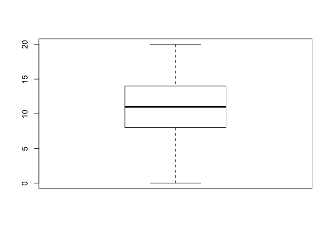

``` r
qqnorm(df$G3)
```

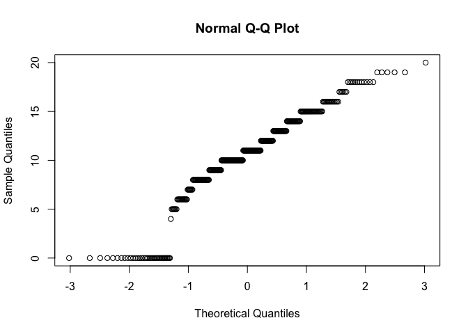

The boxplot and QQ plot indicate that the distribution is fairly normal, with the exception of a cluster of scores that are at or near 0. This could be due to data entry errors or something else, but regardless it will impact the coefficient estimates. I'll omit those from the analysis for now.

Let's make the training and test sets.

``` r
# Make training and test sets
set.seed(1234) # For reproducibility
df <- df[df$G3>1,] # Drop low outliers
trainind <- sample(c(T,F), nrow(df), replace = T, prob = c(0.666, 0.334))
traindf <- df[trainind,]
testdf <- df[!trainind,]
```

Now I'll examine the data and see if there are variables that may be moderated by sex.

``` r
ints <- unlist(lapply(traindf,class))=='integer'
facts <- unlist(lapply(traindf,class))=='factor'
spdf <- melt(traindf,id.vars=c(colnames(traindf)[facts],'G3'))
scatplots <- ggplot(spdf,aes(value,G3,linetype=sex)) +
  geom_count() +
  geom_smooth(method='lm') +
  facet_wrap(~variable,scales='free')
scatplots
```

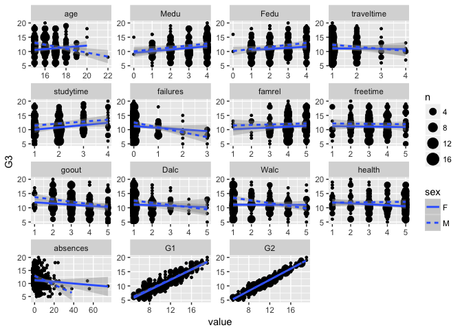

``` r
sexcands <- slist('age traveltime failures Dalc Walc absences')

bpdf <- melt(traindf,id.vars=c(colnames(traindf)[ints],'sex'))
```

    ## Warning: attributes are not identical across measure variables; they will
    ## be dropped

``` r
boxplots <- ggplot(bpdf,aes(value,G3,color=sex)) +
  geom_boxplot() +
  facet_wrap(~variable,scales='free')
boxplots
```

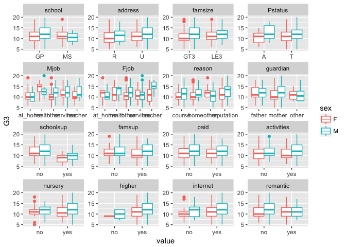

``` r
sexcands <- c(sexcands,slist('school famsize Mjob Fjob reason famsup'))
```

It looks like there may be some moderation by sex with the following variables: age, traveltime, failures, Dalc, Walc, absences, school, famsize, Mjob, Fjob, reason, famsup. I'll keep that in mind as I train the models.

Train models
------------

Now I'll train the models. For illustrative purposes I'm going to train 10 models: Unregularized and elastic net regression with and without G1 and G2 predictors, with and without sex moderation, and just with G1 and G2 predictors.

Training the unregularized linear models is very straight forward, since we don't have to worry about specifying our regularization parameters.

First, I need to define specify what I want the `caret::train` function to do (i.e. define the 10 fold repeated cross validation).

``` r
tc <- trainControl(method = "repeatedcv", # Repeated Cross Validation
                   number = 10, # Number of folds
                   repeats = 5, # Number of repeats
                   verboseIter = F) 
```

Next I'll train the unregularized linear regression models:

``` r
set.seed(1234) # Set seed
lm_justgrades <- train(G3~G2+G1,
                  data=traindf,
                  method='lm',
                  trControl=tc)
lm_full <- train(G3~.,
                  data=traindf,
                  method='lm',
                  trControl=tc)
lm_sex <- train(G3~. -age -traveltime -failures -Dalc -Walc -absences
                -school -famsize -Mjob -Fjob -reason -famsup -sex
                 + (age +traveltime +failures +Dalc +Walc +absences
                    +school +famsize +Mjob +Fjob +reason +famsup)*sex,
                  data=traindf,
                  method='lm',
                  trControl=tc)
lm_cut <- train(G3~.-G2-G1,
                  data=traindf,
                  method='lm',
                  trControl=tc)
lm_cut_sex <- train(G3~.-G2-G1
                     -age -traveltime -failures -Dalc -Walc -absences
                -school -famsize -Mjob -Fjob -reason -famsup -sex
                 + (age +traveltime +failures +Dalc +Walc +absences
                    +school +famsize +Mjob +Fjob +reason +famsup)*sex,
                  data=traindf,
                  method='lm',
                  trControl=tc)
```

    ## Warning in predict.lm(modelFit, newdata): prediction from a rank-deficient
    ## fit may be misleading

``` r
model_list <- list(lm_justgrades=lm_justgrades,
                   lm_full=lm_full,lm_sex=lm_sex,
                   lm_cut=lm_cut, lm_cut_sex=lm_cut_sex)
```

Now we can compare the accuracy of the unregularized regression models:

``` r
resamples(model_list) %>%
  summary()
```

    ## 
    ## Call:
    ## summary.resamples(object = .)
    ## 
    ## Models: lm_justgrades, lm_full, lm_sex, lm_cut, lm_cut_sex 
    ## Number of resamples: 50 
    ## 
    ## MAE 
    ##                    Min.   1st Qu.    Median      Mean   3rd Qu.      Max.
    ## lm_justgrades 0.4164348 0.5819209 0.6379229 0.6412139 0.7275137 0.8823259
    ## lm_full       0.5068893 0.6287945 0.6993835 0.7162291 0.7911043 1.0564870
    ## lm_sex        0.5337960 0.6956095 0.7650695 0.7840477 0.8714166 1.1503173
    ## lm_cut        1.7896202 2.2775609 2.4942465 2.4940098 2.6812995 3.2748580
    ## lm_cut_sex    1.8966704 2.3579180 2.5216424 2.5456553 2.7525370 3.4010258
    ##               NA's
    ## lm_justgrades    0
    ## lm_full          0
    ## lm_sex           0
    ## lm_cut           0
    ## lm_cut_sex       0
    ## 
    ## RMSE 
    ##                    Min.   1st Qu.    Median      Mean   3rd Qu.     Max.
    ## lm_justgrades 0.5688245 0.7571702 0.8406928 0.8428687 0.9378297 1.076737
    ## lm_full       0.6324039 0.8120334 0.9025317 0.9118129 0.9853363 1.306088
    ## lm_sex        0.7326664 0.8828722 0.9783606 0.9877557 1.0710384 1.463480
    ## lm_cut        2.2671819 2.9009570 3.1350946 3.1183496 3.4015094 3.855115
    ## lm_cut_sex    2.3266581 2.9204629 3.1462204 3.1549598 3.3204756 4.101123
    ##               NA's
    ## lm_justgrades    0
    ## lm_full          0
    ## lm_sex           0
    ## lm_cut           0
    ## lm_cut_sex       0
    ## 
    ## Rsquared 
    ##                      Min.    1st Qu.    Median      Mean   3rd Qu.
    ## lm_justgrades 0.881546329 0.92406146 0.9356593 0.9348648 0.9531608
    ## lm_full       0.834408100 0.91758938 0.9282264 0.9235447 0.9381106
    ## lm_sex        0.808116330 0.89379174 0.9188527 0.9127359 0.9395250
    ## lm_cut        0.002341716 0.08554963 0.1728539 0.1774482 0.2484728
    ## lm_cut_sex    0.018970838 0.11408781 0.1608571 0.1879210 0.2683620
    ##                    Max. NA's
    ## lm_justgrades 0.9734691    0
    ## lm_full       0.9610751    0
    ## lm_sex        0.9626516    0
    ## lm_cut        0.3872567    0
    ## lm_cut_sex    0.4022794    0

Comparing the accuracy measures of the models, even though sex moderated some variables in our previous analysis, when it comes to prediction, the model without sex interaction preforms better. In fact, based on just the training data, a model with just G1 and G2 grades is the most accurate.

Now let's train the elastic net models that mirror the unregularized models we trained earlier. First we need to choose which values of *α* (i.e. the hyperparameter that defines the mix of ridge and lasso) and *λ* (i.e. the penalty) to use. For lambda, it's best to try a few values that range from very close to zero to 1. If greater resoultion is required after an initial run, you can add more values. Models should also be run with different levels of alpha, from 0 (pure ridge) to 1 (pure lasso). These values are defined in the `train` function. The more values of lambda you include, the slower it will run, particularly with lots of data/predictors. Even though this dataset is pretty small, I'll still start with just a few steps, and then plot the results to get a better sense of the ideal alpha/lambda. Note: `expand.grid()` produces a matrix of all possible combinations.

``` r
set.seed(1234)
en_justgrades <- train(G3~G2+G1,
                  data=traindf,
                  method='glmnet', # glmnet carries out lasso/ridge/elastic net
                  trControl=tc,
                 tuneGrid = expand.grid(alpha=seq(0,1,.1),
                                        lambda=seq(.001,1,length=5)))
en_justgrades$bestTune
```

    ##    alpha lambda
    ## 36   0.7  0.001

``` r
min(en_justgrades$results['RMSE'])
```

    ## [1] 0.8430081

``` r
plot(en_justgrades)
```

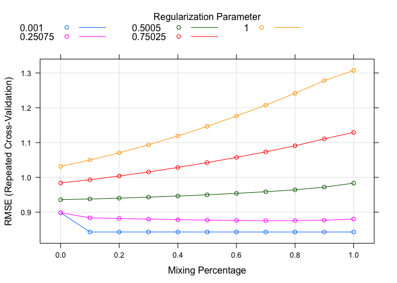

The results indicate that the best alpha is .7, but looking at the plot, there isn't much difference across alphas after .1. Also, the regularization parameter (lambda) should be tiny (.001). Basically there isn't much regularization here.

Moving on.

``` r
set.seed(1234)
en_full <- train(G3~.,
                  data=traindf,
                  method='glmnet', # glmnet carries out lasso/ridge/elastic net
                  trControl=tc,
                 tuneGrid = expand.grid(alpha=seq(0,1,.1),
                                        lambda=seq(.001,1,length=5)))
en_full$bestTune
```

    ##    alpha  lambda
    ## 22   0.4 0.25075

``` r
min(en_full$results['RMSE'])
```

    ## [1] 0.8733647

``` r
plot(en_full)
```

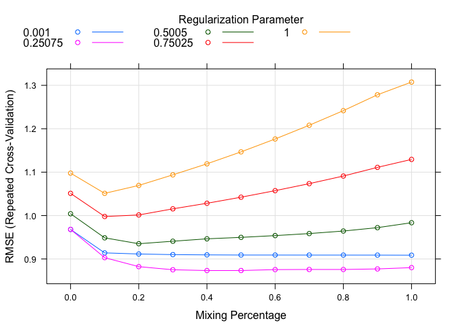

Here again, the alpha parameter is similar after about .4, but the performs best at around .8. The ideal lambda parameter is ~.25.

``` r
set.seed(1234)
en_sex <- train(G3~.+ (age +traveltime +failures +Dalc +Walc +absences
                    +school +famsize +Mjob +Fjob +reason +famsup)*sex,
                  data=traindf,
                  method='glmnet', # glmnet carries out lasso/ridge/elastic net
                  trControl=tc,
                 tuneGrid = expand.grid(alpha=seq(0,1,.1),
                                        lambda=seq(.001,1,length=5)))
en_sex$bestTune
```

    ##    alpha  lambda
    ## 22   0.4 0.25075

``` r
min(en_sex$results['RMSE'])
```

    ## [1] 0.8727546

``` r
plot(en_sex)
```

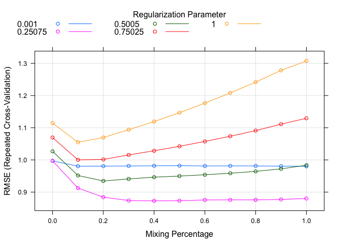

Now let's see what happens when we remove G1 and G2.

``` r
set.seed(1234)
en_cut <- train(G3~.-G1-G2,
                  data=traindf,
                  method='glmnet', # glmnet carries out lasso/ridge/elastic net
                  trControl=tc,
                 tuneGrid = expand.grid(alpha=seq(0,1,.1),
                                        lambda=seq(.001,1,length=5)))
```

    ## Warning in nominalTrainWorkflow(x = x, y = y, wts = weights, info =
    ## trainInfo, : There were missing values in resampled performance measures.

``` r
en_cut$bestTune
```

    ##    alpha lambda
    ## 18   0.3 0.5005

``` r
min(en_cut$results['RMSE'])
```

    ## [1] 2.903672

``` r
plot(en_cut)
```

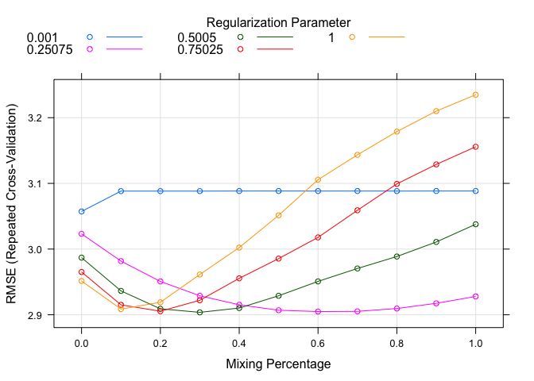

Take a closer look at the alpha/lambda values:

``` r
set.seed(1234)
en_cut1 <- train(G3~.-G1-G2,
                  data=traindf,
                  method='glmnet', # glmnet carries out lasso/ridge/elastic net
                  trControl=tc,
                 tuneGrid = expand.grid(alpha=seq(.4,.6,.02),
                                        lambda=seq(.15,.35,length=5)))
en_cut1$bestTune
```

    ##    alpha lambda
    ## 15  0.44   0.35

``` r
min(en_cut1$results['RMSE'])
```

    ## [1] 2.903995

``` r
plot(en_cut1)
```

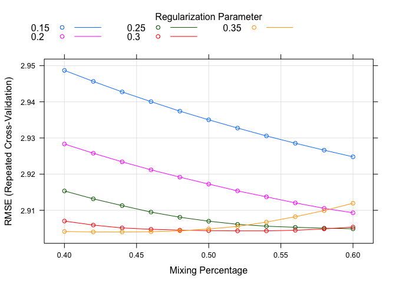

``` r
en_cut <- en_cut1 # Replace with better tune
```

Getting more granular gives a different bestTune, but only very slightly lower RMSE. That means there probably isn't much of a practical difference between the two. I'll go with the parameters that gives the lower RMSE anyway.

Now for sex interactions:

``` r
set.seed(1234)
en_cut_sex <- train(G3~.-G2-G1
                    + (age +traveltime +failures +Dalc +Walc +absences
                    +school +famsize +Mjob +Fjob +reason +famsup)*sex,
                  data=traindf,
                  method='glmnet', # glmnet carries out lasso/ridge/elastic net
                  trControl=tc,
                 tuneGrid = expand.grid(alpha=seq(0,1,.1),
                                        lambda=seq(.001,1,length=5)))
```

    ## Warning in nominalTrainWorkflow(x = x, y = y, wts = weights, info =
    ## trainInfo, : There were missing values in resampled performance measures.

``` r
en_cut_sex$bestTune
```

    ##    alpha lambda
    ## 10   0.1      1

``` r
min(en_cut_sex$results['RMSE'])
```

    ## [1] 2.89454

``` r
plot(en_cut_sex)
```

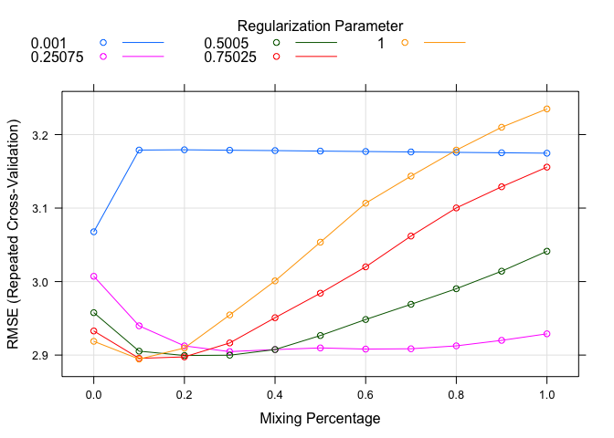

Including the interactions, it looks like a smaller alpha and larger lambda are preferable. Let's take a closer look

``` r
set.seed(1234)
en_cut_sex1 <- train(G3~.-G2-G1
                     -age -traveltime -failures -Dalc -Walc -absences
                -school -famsize -Mjob -Fjob -reason -famsup -sex
                 + (age +traveltime +failures +Dalc +Walc +absences
                    +school +famsize +Mjob +Fjob +reason +famsup)*sex,
                  data=traindf,
                  method='glmnet', # glmnet carries out lasso/ridge/elastic net
                  trControl=tc,
                 tuneGrid = expand.grid(alpha=seq(0,.2,.02),
                                        lambda=seq(.001,1,length=5)))
en_cut_sex1$bestTune
```

    ##    alpha lambda
    ## 25  0.08      1

``` r
min(en_cut_sex1$results['RMSE'])
```

    ## [1] 2.893737

``` r
plot(en_cut_sex1)
```

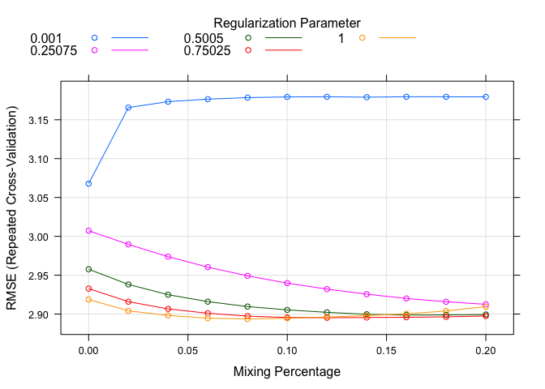

``` r
en_cut_sex <- en_cut_sex1
```

Again, with the updated lambda value, the difference in RMSE is negligible, and the difference between a lambda of 1 and .75 is also tiny. We'll still go with the model that produced the lower RMSE.

Now let's compare the performance of the various models on the training data.

``` r
model_list <- list(lm_justgrades=lm_justgrades, 
                   lm_full=lm_full,lm_sex=lm_sex,
                   lm_cut=lm_cut, lm_cut_sex=lm_cut_sex,
                   en_justgrades=en_justgrades, 
                   en_full=en_full,en_sex=en_sex,
                   en_cut=en_cut, en_cut_sex=en_cut_sex)

resamples(model_list) %>%
  summary()
```

    ## 
    ## Call:
    ## summary.resamples(object = .)
    ## 
    ## Models: lm_justgrades, lm_full, lm_sex, lm_cut, lm_cut_sex, en_justgrades, en_full, en_sex, en_cut, en_cut_sex 
    ## Number of resamples: 50 
    ## 
    ## MAE 
    ##                    Min.   1st Qu.    Median      Mean   3rd Qu.      Max.
    ## lm_justgrades 0.4164348 0.5819209 0.6379229 0.6412139 0.7275137 0.8823259
    ## lm_full       0.5068893 0.6287945 0.6993835 0.7162291 0.7911043 1.0564870
    ## lm_sex        0.5337960 0.6956095 0.7650695 0.7840477 0.8714166 1.1503173
    ## lm_cut        1.7896202 2.2775609 2.4942465 2.4940098 2.6812995 3.2748580
    ## lm_cut_sex    1.8966704 2.3579180 2.5216424 2.5456553 2.7525370 3.4010258
    ## en_justgrades 0.4252300 0.5857594 0.6407055 0.6435303 0.7293914 0.8819141
    ## en_full       0.4455800 0.6367028 0.6886989 0.6988545 0.7930072 0.9419654
    ## en_sex        0.4454650 0.6279716 0.6885572 0.6976339 0.7935252 0.9432714
    ## en_cut        1.8760913 2.1559563 2.3715744 2.3624375 2.5472606 2.9416761
    ## en_cut_sex    1.8231249 2.1029165 2.3347911 2.3290275 2.5552348 2.9700652
    ##               NA's
    ## lm_justgrades    0
    ## lm_full          0
    ## lm_sex           0
    ## lm_cut           0
    ## lm_cut_sex       0
    ## en_justgrades    0
    ## en_full          0
    ## en_sex           0
    ## en_cut           0
    ## en_cut_sex       0
    ## 
    ## RMSE 
    ##                    Min.   1st Qu.    Median      Mean   3rd Qu.     Max.
    ## lm_justgrades 0.5688245 0.7571702 0.8406928 0.8428687 0.9378297 1.076737
    ## lm_full       0.6324039 0.8120334 0.9025317 0.9118129 0.9853363 1.306088
    ## lm_sex        0.7326664 0.8828722 0.9783606 0.9877557 1.0710384 1.463480
    ## lm_cut        2.2671819 2.9009570 3.1350946 3.1183496 3.4015094 3.855115
    ## lm_cut_sex    2.3266581 2.9204629 3.1462204 3.1549598 3.3204756 4.101123
    ## en_justgrades 0.5696901 0.7605221 0.8406956 0.8430081 0.9352539 1.073558
    ## en_full       0.5799671 0.7977333 0.8584740 0.8733647 0.9832036 1.137500
    ## en_sex        0.5795043 0.7960960 0.8596068 0.8727546 0.9830728 1.139142
    ## en_cut        2.3905086 2.6709388 2.9030580 2.9039952 3.0654001 3.682938
    ## en_cut_sex    2.3604418 2.6100946 2.8970988 2.8937374 3.1705653 3.603031
    ##               NA's
    ## lm_justgrades    0
    ## lm_full          0
    ## lm_sex           0
    ## lm_cut           0
    ## lm_cut_sex       0
    ## en_justgrades    0
    ## en_full          0
    ## en_sex           0
    ## en_cut           0
    ## en_cut_sex       0
    ## 
    ## Rsquared 
    ##                      Min.    1st Qu.    Median      Mean   3rd Qu.
    ## lm_justgrades 0.881546329 0.92406146 0.9356593 0.9348648 0.9531608
    ## lm_full       0.834408100 0.91758938 0.9282264 0.9235447 0.9381106
    ## lm_sex        0.808116330 0.89379174 0.9188527 0.9127359 0.9395250
    ## lm_cut        0.002341716 0.08554963 0.1728539 0.1774482 0.2484728
    ## lm_cut_sex    0.018970838 0.11408781 0.1608571 0.1879210 0.2683620
    ## en_justgrades 0.881417583 0.92449608 0.9358257 0.9348486 0.9528876
    ## en_full       0.871570048 0.91639708 0.9352508 0.9331136 0.9508066
    ## en_sex        0.874531655 0.91715249 0.9351639 0.9331656 0.9508322
    ## en_cut        0.035413536 0.14480828 0.2021812 0.2246937 0.3101604
    ## en_cut_sex    0.011545449 0.12981856 0.2306719 0.2317987 0.3203146
    ##                    Max. NA's
    ## lm_justgrades 0.9734691    0
    ## lm_full       0.9610751    0
    ## lm_sex        0.9626516    0
    ## lm_cut        0.3872567    0
    ## lm_cut_sex    0.4022794    0
    ## en_justgrades 0.9732795    0
    ## en_full       0.9715903    0
    ## en_sex        0.9715529    0
    ## en_cut        0.4781704    0
    ## en_cut_sex    0.5232610    0

Elastic net regularization improves prediction slightly for all models with the exception of those that only include G1 and G2 grades. In those models, the unregularized linear model performs just as well as the elastic net. Looking at some more plots can help explain why:

``` r
plot(varImp(model_list$lm_full),main='Importance of variables in lm_full')
```

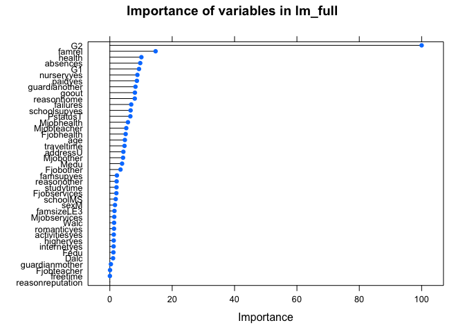

``` r
plot(varImp(model_list$en_full),main='Importance of variables in en_full',
     top=9)
```

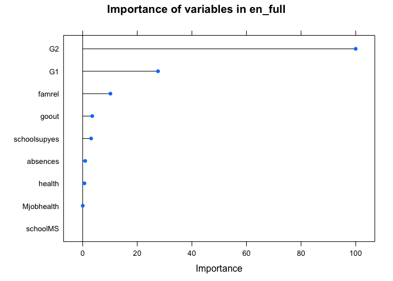

``` r
plot(varImp(model_list$en_sex),main='Importance of variables in en_sex',
     top=10)
```

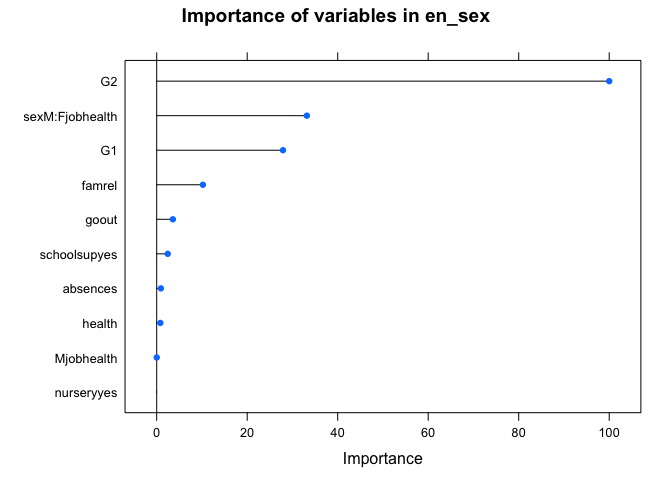

G1 and G2 are such strong predictors, that elastic net model either removes or highly penalizes the other variables. In models without G1 and G2, there are still some predictors that don't add anything to the model:

``` r
plot(varImp(model_list$en_cut),main='Importance of variables in en_cut',top=20)
```

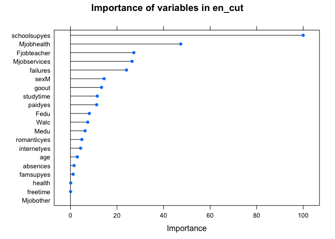

``` r
plot(varImp(model_list$en_cut_sex),
     main='Importance of variables in en_cut_sex',top=43)
```

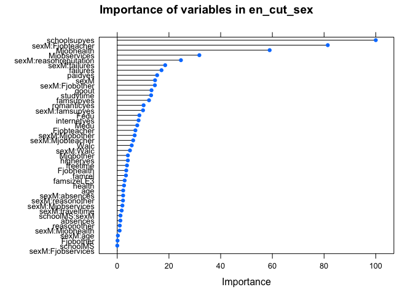

Without sex interactions, 19/30 variables added anything to the model. With sex interactions, 42/59 variables contributed. I'll discuss this a little more later, but for now, let's see how the model performs on the test set.

``` r
test_rmse <- rep(NA,length(model_list))
names(test_rmse) <- names(model_list)
for(i in 1:length(model_list)) {
  test_rmse[i] <- sqrt(mean((testdf$G3-predict(model_list[[i]],testdf))^2))
}
test_mae <- rep(NA,length(model_list))
names(test_mae) <- names(model_list)
for(i in 1:length(model_list)) {
  test_mae[i] <- mean(abs(testdf$G3-predict(model_list[[i]],testdf)))
}

(resultdf <- data.frame(train_rmse=sapply(model_list,
                                         function(x) min(x$results['RMSE'])),
           test_rmse=test_rmse,
           train_mae=sapply(model_list,function(x) min(x$results['MAE'])),
           test_mae=test_mae))
```

    ##               train_rmse test_rmse train_mae  test_mae
    ## lm_justgrades  0.8428687 0.7912134 0.6412139 0.6107569
    ## lm_full        0.9118129 0.8402798 0.7162291 0.6640703
    ## lm_sex         0.9877557 0.8560983 0.7840477 0.6629530
    ## lm_cut         3.1183496 2.9513397 2.4940098 2.3926618
    ## lm_cut_sex     3.1549598 3.1356952 2.5456553 2.5227594
    ## en_justgrades  0.8430081 0.7943688 0.6413910 0.6147203
    ## en_full        0.8733647 0.8454382 0.6967492 0.6662876
    ## en_sex         0.8727546 0.8482493 0.6967492 0.6673343
    ## en_cut         2.9039952 2.9076271 2.3609177 2.4144209
    ## en_cut_sex     2.8937374 2.8602960 2.3275937 2.4035728

Based on the RMSE (and MAE) of the test set, the models with just grades as predictors out-performed all other models. If previous grades aren't included, the elastic net models do appear to (very slightly) improve accuracy. Technically, among the models without grades as predictors, the elastic net model incorporating interactions with sex achieved the lowest RMSE among the test set. Given that the difference is relatively small and the model without interactions performed better with the training data, the 'best' model is debatable.

Summary/Interpretation
======================

I used this data to address an admittedly contrived scenario, and I ran many models to illustrate a few points along the way:

1.  Just because you *have* a lot of data, doesn't mean you need to use it all.
    -   If this were a real scenario, someone had all the data (including grades), their circumstances didn't necessitate making predictions without the previous grades variables, AND their goal really was just prediction, I'd tell them not to waste their time gathering any other information or fussing with a big fancy model. In this case, a very simple regression model will do very nicely with low error. Notably, even if you *do* implement a more complex model, most of the predictors end up being removed anyway. I think that's a generalizable point: make sure your analytic strategy matches the goals and priorities involved in why you're analyzing anything in the first place.
2.  Even if you don't start with 'garbage' per se, predictions are governed by the quality of data.
    -   Without the strong predictive qualities of G1 and G2, model accuracy goes down substantially. Regularization may help with getting very slightly better estimates, but the RMSE remains around 2.9-3 regardless. Compare that to the training set standard deviation of 3.2609963, and the added value of the model looks quite modest indeed.
3.  Right tool for the right job.
    -   Regularization tools are great for certain scenarios. In this particular situation, as the modest improvements in the models show, they may not be all that necessary. When your model inherently underfits the data, regularization is unlikely to help much. If possible, your best bet is to gather better data or find a different way to better specify the model.

I'll be moving on from this particular dataset in future posts, and will also start posting projects using python. As always, I hope to continually increase the quality of posts and tackle more interesting problems and datasets. If you have any questions or comments, feel free to email me at <alex@alexdatasci.com>.
