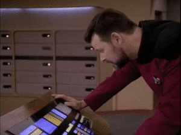
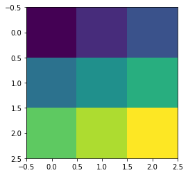

# Heading for test python.


```python
import numpy as np
import matplotlib.pyplot as plt
%matplotlib inline
a = np.arange(10)
b = a.reshape((5,2))
```


```python
print(a)
print(b)
```

    [0 1 2 3 4 5 6 7 8 9]
    [[0 1]
     [2 3]
     [4 5]
     [6 7]
     [8 9]]


```python
aa = np.arange(9)
aa = aa.reshape((3,3))
```


```python
plt.imshow(aa)
```


    <matplotlib.image.AxesImage at 0x110e79c50>




